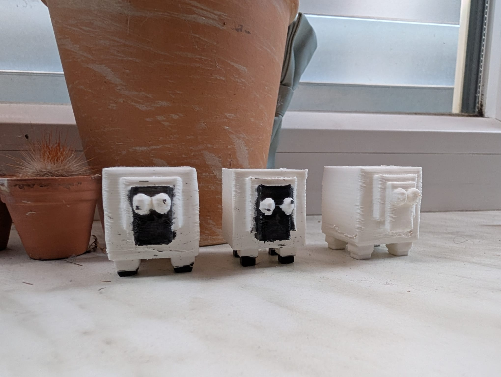

# my-own-3d-prints
Learning some Blender and PicoCad to make my own printable stl Files.

3D - Sheep (in Blender vs picoCAD2)

# Print Settings
* Printer:
    Creality Ender V3 KE
* Rafts:
    No
* Supports:
    Yes
* Infill:
    16%
* Notes:
    Printed with PLA on a heated bed.

# Images:

The 3D-Print turned out pretty horrific because I have some Issues with Z-wobble it seems like, and I haven't managed to fix that in hours. Also it isn't like a perfect solution but I painted the different colored parts with a sharpie. The 3D-Models are fine tho and should print perfectly fine on other 3D-Printers, it's just this Z-wobble issue I am having that makes them look all botched and such.

